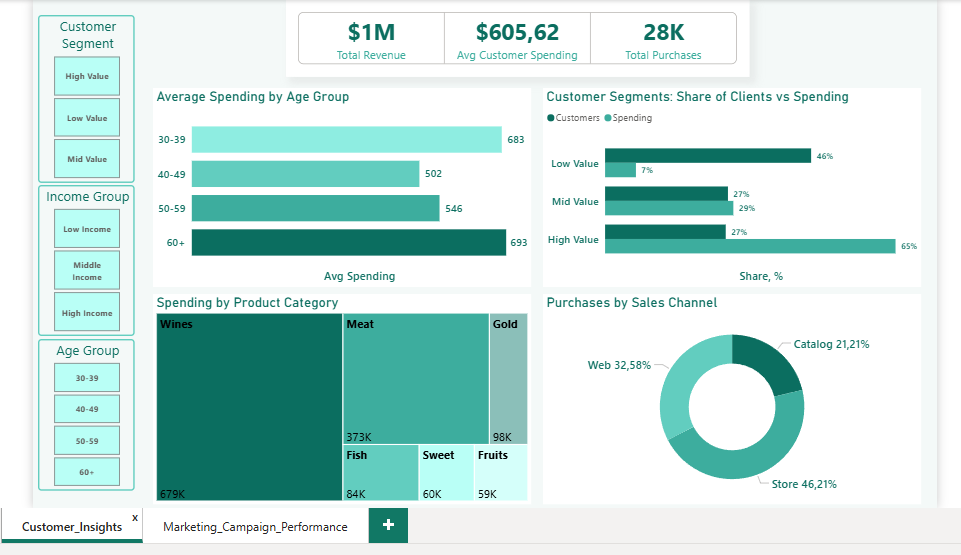
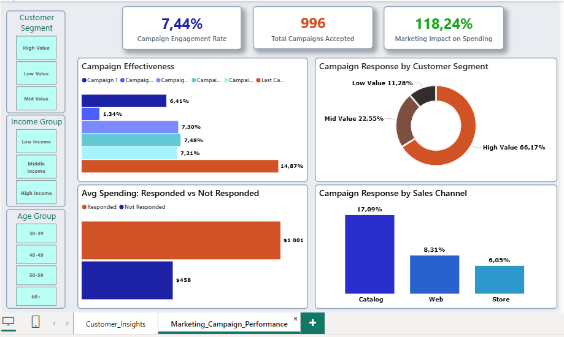

# Customer Personality Analysis
Marketing analysis of a retail store customer base

## About the Project
Full-cycle analysis of 2,233 retail store customers. Goal — identify who generates the most revenue, how marketing campaigns perform, and which customer segments are most valuable for the business.

**Tools:** Python (pandas, numpy) · Power BI · DAX

---

## Key Insights

### Insight #1 — Pareto Principle Confirmed
27% of customers (High Value) generate 65% of total spending. 46% of customers (Low Value) contribute only 7% of revenue. Segmentation is based on Total_Spending percentiles: High Value > $1,044 (above 75th percentile), Mid Value $69–$1,044 (between 25th and 75th percentile), Low Value < $69 (below 25th percentile).

### Insight #2 — Channel Priority
Catalog has the highest campaign response rate (17.09%) but generates only 21% of purchases. Store dominates purchases (46%) but shows the lowest campaign response rate (6.05%). Catalog should be used as an acquisition tool rather than a primary sales channel.

### Insight #3 — Last Campaign Effect
Last Campaign showed a 14.87% response rate — twice the average (~7%). Worth analyzing what was done differently (mechanics, targeting, timing) and scaling that experience.

### Insight #4 — Marketing Works but Misses the Target
66% of all campaign responses come from the High Value segment — marketing retains loyal customers but barely activates passive ones. The Low Value segment (46% of customers) responds to only 11% of campaigns.

### Insight #5 — Active Customers Spend Twice as Much
Customers who responded to campaigns spend $1,001 on average vs $458 for those who ignored them — a 118% difference. Important: this is correlation not causation — the dataset does not contain spending data before and after campaigns.

### Insight #6 — Age Group 40-49 — Undervalued Segment
Average spending $502 — the lowest among all age groups. Groups 30-39 ($683) and 60+ ($693) spend 35% more. Requires further investigation — assortment, pricing, or communication may be the cause.

### Insight #7 — Wines and Meat Are the Business Core
Wines ($679K) — nearly 50% of all spending. Meat ($373K) — a stable second priority. Together these two categories account for over 77% of spending.

---

## Business Recommendations

1. **Retaining High Value customers is priority #1.** A loyalty program targeting the top 27% of customers will pay off faster than any other initiative.

2. **Separate strategy for the Low Value segment.** Standard campaigns do not work for this audience. A different approach is needed — lower entry threshold, different product categories or communication channel.

3. **Scale the Last Campaign experience.** 14.87% response rate — a result worth studying in detail.

4. **Catalog as an acquisition tool.** High campaign sensitivity (17.09%) makes it ideal for targeted marketing activations.

5. **Investigate age group 40-49.** Lowest spending among all age groups — requires separate research into the causes.

6. **Wines and Meat — promotion priority.** Focusing promo activities on top categories will deliver maximum return on marketing budget.

---

## Dashboard 1 — Customer Insights

**Goal:** Answer two business questions: who is our customer and who generates the most revenue.

**Structure:**
- 3 KPI cards: Total Revenue, Avg Customer Spending, Total Purchases
- Filters: Customer Segment, Income Group, Age Group
- 4 charts: segments, age, product categories, sales channels

**Key Insights:**
- **Pareto:** 27% of customers generate 65% of spending
- **Age:** Most active 30-39 and 60+ ($683/$693), least active 40-49 ($502)
- **Products:** Wines ($679K) and Meat ($373K) — 77% of spending
- **Channels:** Store 46%, Web 33%, Catalog 21%

---

## Dashboard 2 — Marketing Campaign Performance

**Goal:** Evaluate marketing campaign effectiveness and analyze how customer segments respond to marketing offers.

**Structure:**
- 3 KPI cards: Engagement Rate, Campaigns Accepted, Marketing Impact on Spending
- 4 charts: campaign effectiveness, spending responded vs not responded, response by segment, response by channel

**Key Insights:**
- **Effectiveness:** Last Campaign — 14.87% (leader). Campaign 2 — 1.34% (underperformer)
- **Spending impact:** Responded ($1,001) vs Not Responded ($458). Difference 118%
- **Segments:** High Value generates 66% of responses, Low Value — only 11%
- **Channels:** Catalog responds best (17%), Store worst (6%)

---

## Stage 1 — Data Profiling

**Goal:** Understand data quality: completeness, anomalies, business logic compliance.

**Key Issues and Solutions:**
- **Constant columns:** Removed (Z_CostContact, Z_Revenue)
- **Age anomalies:** Removed 3 customers (born 1893–1900)
- **Income anomaly:** Removed customer with Income=$666K and spending of only $62
- **Garbage categories:** Removed Absurd, YOLO. Alone replaced with Single
- **Missing values:** 24 nulls in Income filled with median by Education group

---

## Stage 2 — Data Cleaning

**Result:**
- Before: 2,240 rows, 29 columns
- After: 2,233 rows, 27 columns
- Missing values: 0

---

## Stage 3 — Feature Engineering

**New columns created:**

| `Age` | Customer age |
| `Customer_Tenure` | Days as a customer |
| `Total_Spending` | Total spending over 2 years |
| `Avg_Monthly_Spending` | Average monthly spending |
| `Total_Purchases` | Total purchase count |
| `Preferred_Channel` | Favorite sales channel |
| `Spending_Per_Purchase` | Average transaction value |
| `Total_Campaigns_Accepted` | Number of campaigns accepted |
| `Campaign_Engagement_Rate` | Campaign response rate % |

**File saved:** `data/processed/marketing_campaign_features.csv`

---

## Tech Stack
- **Python:** pandas, numpy
- **Power BI:** DAX, interactive dashboards
- **Methods:** IQR, Z-score, percentile segmentation, correlation analysis

---

## Project Structure

03_customer_segmentation_marketing_analysis/
├── data/
│   ├── raw/
│   │   └── marketing_campaign.csv
│   └── processed/
│       ├── marketing_campaign_clean.csv
│       └── marketing_campaign_features.csv
├── notebooks/
│   ├── 01_data_profiling.py
│   ├── 02_data_cleaning.py
│   └── 03_feature_engineering.py
├── Power BI/
│   └── customer_analysis.pbix
└── README.md
