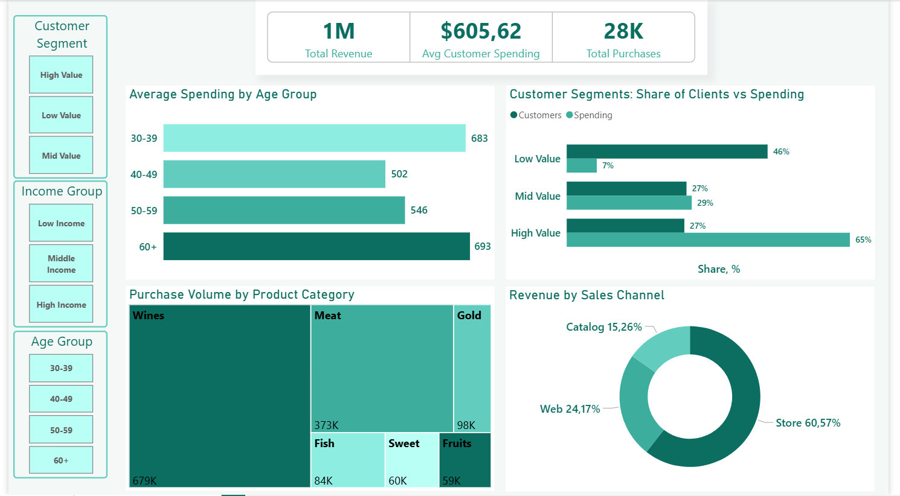
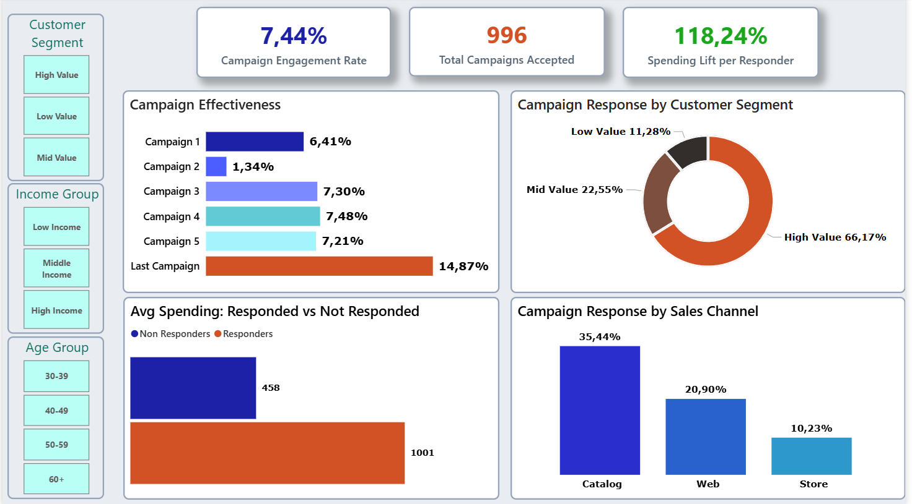

[UA - Українська версія](readme_ua.md) | **EN**

# Customer Personality Analysis




## About the Project

A full-cycle analysis of a retail customer base of 2233 clients. The goal is to identify who generates the most revenue, how marketing campaigns perform, and which customer segments are most valuable for the business. The dataset was sourced from Kaggle. The pipeline includes data cleaning and enrichment in Python and interactive dashboard development in Power BI.

## Key Findings and Insights

**Findings**

The majority of the customer base has almost no impact on revenue. The Low Value segment accounts for 46% of all clients but generates only 7% of spending. High Value, sharing the same client share as Mid Value (27%), is responsible for 65% of all spending (Customer Segments: Share of Clients vs Spending). The concentration of revenue among a minority of clients is the defining characteristic of this dataset.

Customers who respond to campaigns spend more than twice as much as those who do not. Responders show average spending of 1001 compared to 458 for Non Responders (Avg Spending: Responded vs Not Responded), which directly produces a Spending Lift per Responder of 118.24%.

Wines and Meat together account for the vast majority of purchase volume (679K and 373K respectively, Purchase Volume by Product Category), making them the key categories for assortment and promotional strategy.

**Insights**

The 30-39 and 60+ age groups spend significantly more than middle-aged customers. Average Spending by Age Group shows 683 for the 30-39 group and 693 for 60+, while 40-49 (502) and 50-59 (546) fall noticeably behind. This indicates that middle-aged customers are the least active segment by spending despite their size.

Store is the primary revenue channel but the weakest in terms of marketing engagement. Revenue by Sales Channel places Store at 60.57%, yet Campaign Response by Sales Channel shows only 10.23%. Catalog, generating just 15.26% of revenue, delivers the highest campaign response of all channels at 35.44%. This is a direct contradiction between revenue and marketing responsiveness across channels.

The High Value segment dominates both in spending and campaign response. With a 27% client share, this segment generates 65% of spending (Customer Segments: Share of Clients vs Spending) and 66.17% of all campaign responses (Campaign Response by Customer Segment). This makes High Value critically important from two independent perspectives.

Campaign 2 stands out sharply as an underperformer. Campaign Effectiveness shows only 1.34% for Campaign 2, while all other campaigns fall in the range of 6.41-7.48%. No data is available on the cause.

Last Campaign delivers a result that stands above all previous campaigns. Campaign Effectiveness records 14.87% - nearly twice the rate of Campaign 3, 4, and 5 (7.21-7.48%). No context is available, but the finding is significant.

## Business Recommendations

Retaining and developing the High Value segment is the top priority. This segment represents 27% of clients, 65% of spending, and 66.17% of campaign responses. No other segment delivers such a concentration of value across both revenue and marketing responsiveness (Customer Segments: Share of Clients vs Spending, Campaign Response by Customer Segment).

The marketing strategy for the Store channel needs revision. Store generates 60.57% of revenue but campaign response stands at only 10.23% - the lowest of all channels (Revenue by Sales Channel, Campaign Response by Sales Channel). This suggests that current campaigns are not tailored to the audience of the primary sales channel.

The Catalog channel experience is worth studying as a marketing model. With a revenue share of 15.26%, Catalog achieves a campaign response of 35.44% - the highest result across all channels. Approaches that work in Catalog could potentially be adapted for other channels.

The 30-39 and 60+ age groups are the priority targets by spending. Average Spending by Age Group confirms them as the highest-spending groups (683 and 693 respectively). The 40-49 and 50-59 groups show lower figures (502 and 546) - there is potential here for a dedicated activation strategy.

Increasing campaign engagement directly impacts revenue. The gap between Responders (1001) and Non Responders (458) is twofold (Avg Spending: Responded vs Not Responded). Even a modest increase in Campaign Engagement Rate (currently 7.44%) could have a material effect on overall results.

## Dashboard 1 - Customer Insights

This dashboard provides an overall picture of the customer base: total revenue generated, who the clients are by age and segment, what they buy, and through which channels.

**Key Metrics**

- Total Revenue - total revenue across the entire base: 1M
- Avg Customer Spending - average spending per customer: $605,62
- Total Purchases - total number of purchases: 28K

**Average Spending by Age Group**

Horizontal bar chart. Shows average total customer spending by age group. Highest values for the 30-39 (683) and 60+ (693) groups, lowest for 40-49 (502) and 50-59 (546).

**Customer Segments: Share of Clients vs Spending**

Horizontal paired bar chart. Compares the share of clients and the share of spending per segment. Low Value: 46% of clients and 7% of spending. Mid Value: 27% of clients and 29% of spending. High Value: 27% of clients and 65% of spending.

**Purchase Volume by Product Category**

Treemap. Shows the distribution of purchased units by product category. Wines lead with 679K units, followed by Meat (373K), Gold (98K), Fish (84K), Sweet (60K), Fruits (59K).

**Revenue by Sales Channel**

Donut chart. Revenue distribution across sales channels. Store - 60.57%, Web - 24.17%, Catalog - 15.26%.

## Dashboard 2 - Marketing Campaign Performance

This dashboard focuses on the effectiveness of marketing campaigns: which campaigns performed, which segments and channels respond best, and how campaign response relates to customer spending.

**Key Metrics**

- Campaign Engagement Rate - share of clients who accepted at least one campaign: 7.44%
- Total Campaigns Accepted - total number of accepted campaigns: 996
- Spending Lift per Responder - how much more responders spend compared to non-responders: 118.24%

**Campaign Effectiveness**

Horizontal bar chart. Shows response rate per campaign. Campaign 1 - 6.41%, Campaign 2 - 1.34%, Campaign 3 - 7.30%, Campaign 4 - 7.48%, Campaign 5 - 7.21%, Last Campaign - 14.87%.

**Campaign Response by Customer Segment**

Donut chart. Distribution of accepted campaigns by customer segment. High Value - 66.17%, Mid Value - 22.55%, Low Value - 11.28%.

**Avg Spending: Responded vs Not Responded**

Horizontal bar chart. Compares average customer spending based on whether they responded to a campaign. Responders - 1001, Non Responders - 458.

**Campaign Response by Sales Channel**

Vertical bar chart. Shows campaign response rate by channel. Catalog - 35.44%, Web - 20.90%, Store - 10.23%.

## Data Processing

### Stage 1 - Data Profiling

Goal - understand the state of the data: completeness, anomalies, and compliance with business logic.

Validation methods: structural analysis (dataset size, column types, missing values), duplicate detection, IQR method (local outlier detection), Z-score analysis (global anomaly detection), business validation (age, income, registration dates), correlation sanity check, median analysis by group.

| Issue | Detail | Action |
|---|---|---|
| Constant columns | Z_CostContact=3, Z_Revenue=11 | Drop |
| Age anomalies | 3 clients born 1893-1900 | Drop |
| Income anomaly | Income=666,666, spending 62 | Drop |
| Junk categories | Absurd(2), YOLO(2) | Drop |
| Duplicate category | Alone(3) = Single | Replace |
| Missing values | 24 nulls in Income | Median by Education |

### Stage 2 - Data Cleaning

- Before cleaning: 2240 rows, 29 columns
- After cleaning: 2233 rows, 27 columns
- Missing values: 0

### Stage 3 - Feature Engineering

| Column | Description |
|---|---|
| Age | Customer age |
| Customer_Tenure | Number of days as a customer |
| Total_Spending | Total spending over 2 years |
| Avg_Monthly_Spending | Average monthly spending |
| Total_Purchases | Total number of purchases |
| Preferred_Channel | Customer's preferred sales channel |
| Spending_Per_Purchase | Average transaction value |
| Total_Campaigns_Accepted | Number of campaigns accepted |
| Campaign_Engagement_Rate | Campaign response rate |

- Columns after feature engineering: 37
- File saved to: `data/processed/marketing_campaign_features.csv`

### Tech Stack

- Python - pandas, numpy
- Power BI - DAX, interactive dashboards
- Methods - IQR, Z-score, percentile segmentation, correlation analysis

## Project Structure
```
03_customer_segmentation_marketing_analysis/
├── data/
│   ├── raw/
│   │   └── marketing_campaign.csv
│   └── processed/
│       ├── marketing_campaign_clean.csv
│       └── marketing_campaign_features.csv
├── notebooks/
│   ├── 01_data_profiling.py
│   ├── 01_data_profiling_ua.py
│   ├── 02_data_cleaning.py
│   ├── 02_data_cleaning_ua.py
│   ├── 03_feature_engineering.py
│   └── 03_feature_engineering_ua.py
├── Power BI/
│   └── customer_analysis.pbix
├── Customer_Insights_en.png
├── Marketing_Campaign_Performance_en.png
├── readme_ua.md
└── readme_en.md