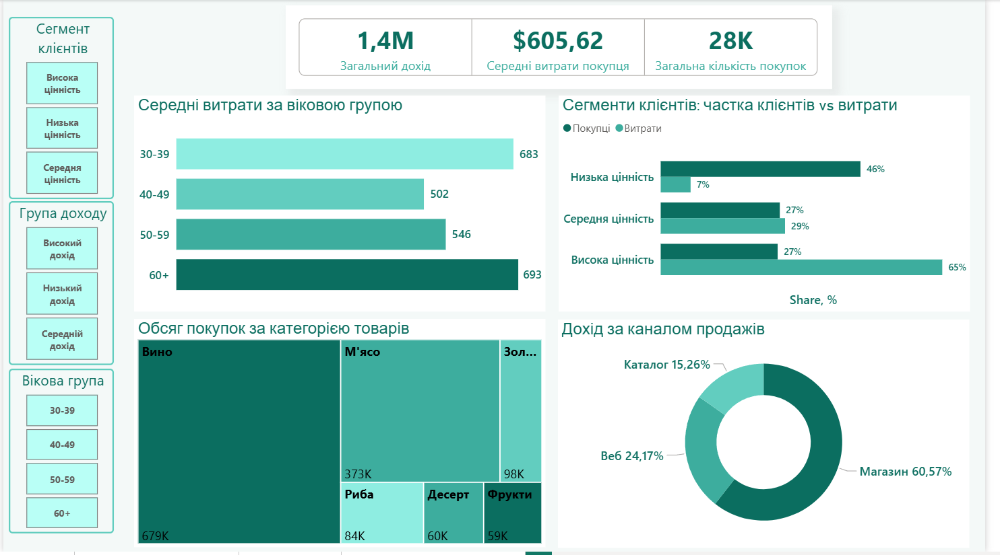
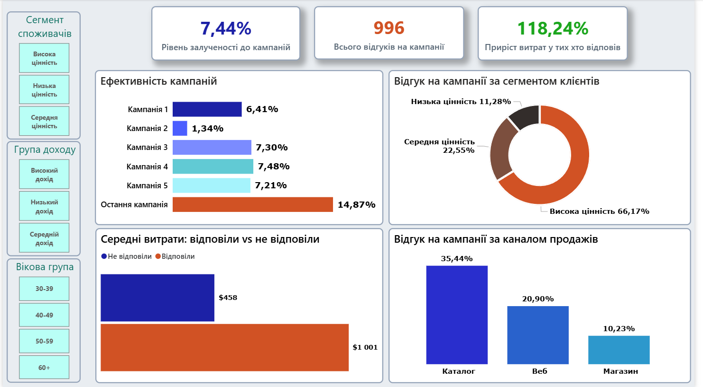

**UA** | [EN - English version](readme_en.md)

# Аналіз поведінки клієнтів

## Про проєкт

Повний цикл аналізу бази з 2233 клієнтів роздрібного магазину. Мета - визначити хто генерує найбільше доходу, як працюють маркетингові кампанії і які сегменти клієнтів найбільш цінні для бізнесу. Датасет отримано з Kaggle. Пайплайн включає очищення та збагачення даних у Python і побудову інтерактивних дашбордів у Power BI.

## Загальні висновки та інсайти

**Висновки**

Більша частина клієнтської бази практично не впливає на дохід. Сегмент Низька цінність становить 46% усіх клієнтів, але генерує лише 7% витрат. Висока цінність, маючи таку саму частку клієнтів як Середня цінність (27%), відповідає за 65% усіх витрат (Сегменти клієнтів: частка клієнтів vs витрати). Концентрація доходу у меншості клієнтів є ключовою характеристикою цих даних.

Клієнти, які відповідають на кампанії, витрачають більш ніж вдвічі більше за тих, хто не відповідає. Клієнти, які відповіли, мають середні витрати $1 001 проти $458 у тих хто не відповів (Середні витрати: відповіли vs не відповіли), що безпосередньо формує Приріст витрат у тих хто відповів 118.24%.

Вино та М'ясо разом складають переважну більшість обсягу покупок (679K та 373K відповідно згідно з Обсяг покупок за категорією товарів), що робить їх ключовими категоріями для асортиментної та промо-стратегії.

**Інсайти**

Вікові групи 30-39 та 60+ витрачають значно більше за середній вік. Середні витрати за віковою групою показують 683 для групи 30-39 і 693 для 60+, тоді як 40-49 (502) та 50-59 (546) помітно відстають. Це вказує на те, що клієнти середнього віку є найменш активними за витратами попри свою чисельність.

Магазин є головним каналом за доходом, але найслабшим за маркетинговою залученістю. Дохід за каналом продажів показує Магазин на рівні 60.57%, проте Відгук на кампанії за каналом продажів - лише 10.23%. Каталог при цьому займає лише 15.26% доходу, але демонструє найвищий відгук серед усіх каналів - 35.44%. Це суттєвий дисбаланс між доходом і реакцією на маркетинг у розрізі каналів.

Сегмент Висока цінність домінує одночасно у витратах і в реакції на кампанії. При частці 27% клієнтів цей сегмент генерує 65% витрат (Сегменти клієнтів: частка клієнтів vs витрати) і 66.17% усіх відгуків на кампанії (Відгук на кампанії за сегментом клієнтів). Це робить Висока цінність критично важливим з двох незалежних сторін.

Кампанія 2 різко виділяється як аутсайдер. Ефективність кампаній показує лише 1.34% для Кампанії 2, тоді як решта кампаній знаходяться в діапазоні 6.41-7.48%. Дані про причину відсутні.

Остання кампанія показує результат, який виділяється на фоні всіх попередніх. Ефективність кампаній фіксує 14.87% - майже вдвічі більше порівняно з Кампанією 3, 4, 5 (7.21-7.48%). Контекст відсутній, але факт значущий.

## Бізнес-рекомендації

Утримання та розвиток сегменту Висока цінність є пріоритетом. Цей сегмент - 27% клієнтів, 65% витрат і 66.17% відгуків на кампанії. Жоден інший сегмент не дає такої концентрації цінності одночасно за доходом і маркетинговою чутливістю (Сегменти клієнтів: частка клієнтів vs витрати, Відгук на кампанії за сегментом клієнтів).

Маркетингова стратегія для каналу Магазин потребує перегляду. Магазин генерує 60.57% доходу, але відгук на кампанії складає лише 10.23% - найнижчий серед усіх каналів (Дохід за каналом продажів, Відгук на кампанії за каналом продажів). Це вказує на те, що поточні кампанії не адаптовані під аудиторію основного каналу продажів.

Досвід каналу Каталог варто вивчити як маркетингову модель. При частці доходу 15.26% Каталог показує відгук 35.44% - найвищий результат серед каналів. Підходи, які працюють у Каталозі, потенційно можуть бути адаптовані для інших каналів.

Вікові групи 30-39 та 60+ є пріоритетними для таргетингу за витратами. Середні витрати за віковою групою підтверджують їх як найбільш витратні (683 та 693 відповідно). Групи 40-49 та 50-59 мають нижчі показники (502 та 546) - тут є потенціал для окремої стратегії активації.

Збільшення залученості до кампаній безпосередньо впливає на дохід. Різниця між тими хто відповів ($1 001) і тими хто не відповів ($458) є двократною (Середні витрати: відповіли vs не відповіли). Навіть невелике зростання Рівня залученості до кампаній (зараз 7.44%) може суттєво вплинути на загальний результат.

## Дашборд 1 - Портрет клієнта

Дашборд надає загальну картину клієнтської бази: скільки генерується доходу, хто ці клієнти за віком і сегментом, що вони купують і через які канали.

**Ключові метрики**

- Загальний дохід - загальний дохід по всій базі: 1M
- Середні витрати покупця - середні витрати одного клієнта: $605,62
- Загальна кількість покупок: 28K

**Середні витрати за віковою групою**

Горизонтальна барна діаграма. Показує середні загальні витрати клієнта в розрізі вікових груп. Найвищі значення у груп 30-39 (683) та 60+ (693), найнижчі у 40-49 (502) та 50-59 (546).

**Сегменти клієнтів: частка клієнтів vs витрати**

Горизонтальна парна барна діаграма. Порівнює частку клієнтів і частку витрат по кожному сегменту. Низька цінність: 46% клієнтів і 7% витрат. Середня цінність: 27% клієнтів і 29% витрат. Висока цінність: 27% клієнтів і 65% витрат.

**Обсяг покупок за категорією товарів**

Treemap. Показує розподіл кількості куплених одиниць товарів по категоріях. Вино домінує з 679K одиниць, далі М'ясо (373K), Золото (98K), Риба (84K), Десерт (60K), Фрукти (59K).

**Дохід за каналом продажів**

Кругова діаграма. Розподіл доходу по каналах продажів. Магазин - 60.57%, Веб - 24.17%, Каталог - 15.26%.

## Дашборд 2 - Ефективність маркетингових кампаній

Дашборд фокусується на ефективності маркетингових кампаній: які кампанії спрацювали, які сегменти і канали реагують найкраще, і як відгук на кампанії пов'язаний з витратами клієнтів.

**Ключові метрики**

- Рівень залученості до кампаній - відсоток клієнтів, які прийняли хоча б одну кампанію: 7.44%
- Всього відгуків на кампанії - загальна кількість прийнятих кампаній: 996
- Приріст витрат серед тих, хто відповів - наскільки більше витрачають ті, хто відповів на кампанію, порівняно з тими, хто не відповів: 118.24%

**Ефективність кампаній**

Горизонтальна барна діаграма. Показує відсоток відгуку по кожній кампанії. Кампанія 1 - 6.41%, Кампанія 2 - 1.34%, Кампанія 3 - 7.30%, Кампанія 4 - 7.48%, Кампанія 5 - 7.21%, Остання кампанія - 14.87%.

**Відгук на кампанії за сегментом клієнтів**

Кругова діаграма. Розподіл прийнятих кампаній по сегментах клієнтів. Висока цінність - 66.17%, Середня цінність - 22.55%, Низька цінність - 11.28%.

**Середні витрати: відповіли vs не відповіли**

Горизонтальна барна діаграма. Порівнює середні витрати клієнтів залежно від того, чи відповіли вони на кампанію. Відповіли - $1 001, Не відповіли - $458.

**Відгук на кампанії за каналом продажів**

Вертикальна барна діаграма. Показує відсоток відгуку по каналах. Каталог - 35.44%, Веб - 20.90%, Магазин - 10.23%.

## Обробка даних

### Етап 1 - Знайомство з даними

Мета - зрозуміти стан даних: повнота, аномалії, відповідність бізнес-логіці.

Інструменти перевірки: структурний аналіз (розмір датасету, типи колонок, пропущені значення), аналіз дублікатів, IQR метод (виявлення локальних викидів), Z-score аналіз (виявлення глобальних аномалій), бізнес-валідація (вік, дохід, дати реєстрації), correlation sanity check, медіанний аналіз по групах.

| Проблема | Деталь | Рішення |
|---|---|---|
| Колонки-константи | Z_CostContact=3, Z_Revenue=11 | Видалити |
| Аномальний вік | 3 клієнти 1893-1900 р.н. | Видалити |
| Аномальний дохід | Income=666,666, витрати 62 | Видалити |
| Сміттєві категорії | Absurd(2), YOLO(2) | Видалити |
| Дублююча категорія | Alone(3) = Single | Замінити |
| Пропущені значення | 24 nulls в Income | Медіана по Education |

### Етап 2 - Чистка даних

- До чистки: 2240 рядків, 29 колонок
- Після чистки: 2233 рядки, 27 колонок
- Пропусків: 0

### Етап 3 - Feature Engineering

| Колонка | Опис |
|---|---|
| Age | Вік клієнта |
| Customer_Tenure | Скільки днів є клієнтом |
| Total_Spending | Загальні витрати за 2 роки |
| Avg_Monthly_Spending | Середні витрати на місяць |
| Total_Purchases | Загальна кількість покупок |
| Preferred_Channel | Улюблений канал клієнта |
| Spending_Per_Purchase | Середній чек |
| Total_Campaigns_Accepted | Скільки кампаній прийняв |
| Campaign_Engagement_Rate | Відсоток відгуку на кампанії |

- Колонок після feature engineering: 37
- Файл збережено: `data/processed/marketing_campaign_features.csv`

### Технічний стек

- Python - pandas, numpy
- Power BI - DAX, інтерактивні дашборди
- Методи - IQR, Z-score, перцентильна сегментація, кореляційний аналіз

## Структура проєкту

03_customer_segmentation_marketing_analysis/
├── data/
│   ├── raw/
│   │   └── marketing_campaign.csv
│   └── processed/
│       ├── marketing_campaign_clean.csv
│       └── marketing_campaign_features.csv
├── notebooks/
│   ├── 01_data_profiling.py
│   ├── 01_data_profiling_ua.py
│   ├── 02_data_cleaning.py
│   ├── 02_data_cleaning_ua.py
│   ├── 03_feature_engineering.py
│   └── 03_feature_engineering_ua.py
├── Power BI/
│   └── customer_analysis.pbix
├── Customer_Insights_en.png
├── Marketing_Campaign_Performance_en.png
├── Портрет_клієнта_ua.png
├── Ефективність_маркетингових_кампаній_ua.png
├── readme_ua.md
└── readme_en.md